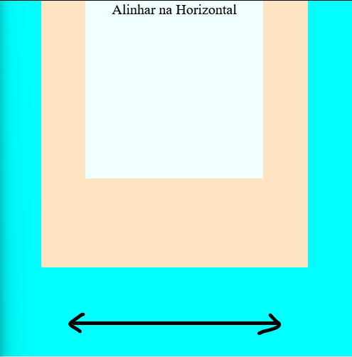

# CSS-Ajuda

Ajuda rapidas de CSS
#

## Alinhamento do conteudo e divs

alinhando os divs e conteudos em HORIZONTAL VERTICAL E CENTRADO VERTICAL E HORIZONTAL
#

## HORIZONTAL

- display: flex;
- justify-content: center;

ou

- display: grid;
- justify-content: center;

&

- text-align: center;

## Vertical

- display: flex;
- align-items: center;

ou

- display: grid;
- align-items: center;

&

- line-height: 200px;

## Center

- display: flex;
- justify-content: center;
- align-items: center;

ou

- display: grid;
- justify-content: center;
- align-items: center;

&

- text-align: center;
- line-height: 200px;
